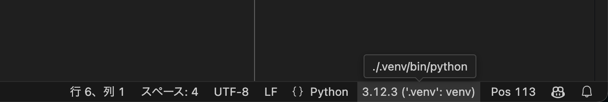
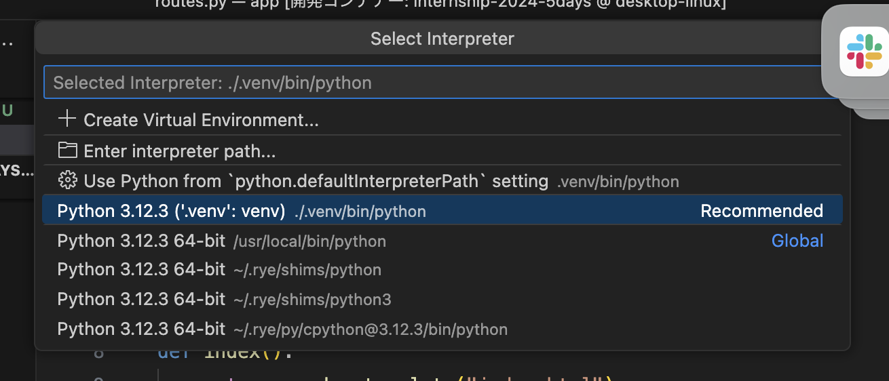

# ニフティ 5days インターン 2026 ベースリポジトリ

このリポジトリはニフティの 5days 開発インターンで利用するテンプレートです。
開発にスムーズに入れるようにするためのテンプレートであって、必ずしもこのスタイルに添う必要はありません。

# 概要

Flask + Bootstrap + MySQL を使用した Web アプリケーションです。
Bootstrap のサンプルとして使えそうなパーツを集めたサンプルページと、必要ならユーザー認証機能を用意しています。

## フォルダ構成

```
.
├── migrations/ # データベースマイグレーションファイル
├── src/
│ ├── web/
│ ├── auth/ # 認証関連のモジュール
│ ├── templates/ # HTMLテンプレート
│ ├── __init__.py
│ ├── app.py # アプリケーションファクトリ
│ ├── config.py # 設定ファイル
│ ├── models.py # データベースモデル
│ └── routes.py # ルーティング
├── pyproject.toml # プロジェクト設定ファイル
└── README.md
```

## 技術スタック

- バックエンド & フロントエンド
  - Python 3.12
  - [Flask 3](https://flask.palletsprojects.com/en/3.0.x/)
  - [Bootstrap 5](https://getbootstrap.com/)
- データベース
  - Flask-SQLAlchemy + Flask-Migrate + MySQL
- パッケージ管理
  - [uv](https://docs.astral.sh/uv/)

## 開発環境の準備方法

このプロジェクトは Visual Studio Code の Dev Container に対応しており、VS Code で開くだけで自動的に環境構築が完了します。基本的に準備していただくものは [Visual Studio Code](https://code.visualstudio.com/) のみで大丈夫です。

1. VS Code に [Dev Containers](https://marketplace.visualstudio.com/items?itemName=ms-vscode-remote.remote-containers) 拡張機能をインストールします。
1. プロジェクトフォルダを VS Code で開きます。
1. 左下の `><` ボタンを押し、現れたメニューから "コンテナで再度開く" (または "Reopen in Container") を選択します。
   - VS Code が Dev Containers を自動的に構築しますが、これには数分かかる場合があります。
   - この過程でなにか問題が発生した場合は遠慮なくメンターに確認してください。
1. VS Code の準備ができたら <http://localhost:18347/> にアクセスできるか確認してください。
   - VS Code の左側にフォルダ構成のツリーが表示されている状態になれば準備はできているはずです。

> [!Note]
>
> VS Code で Python のコードを開いたときに import に大量の赤線が現れる場合はインタプリタを指定してあげる必要があります。VS Code の右下にある、図のようなバージョン表示のボタンをクリックしてください。 (あるいは黄色で「インタプリタを選択」のようなボタンになっているかもしれません。)
> 
> 押すといくつかの選択肢が表示されると思いますが、ここから `.venv/bin/python` が含まれているものを選んでください。
> 

## AI(Claude Code)を使った開発

この開発環境には [Claude Code](https://docs.anthropic.com/claude-code) が AWS Bedrock 経由で利用できるよう用意されています。

### 準備

1. メンターから DM で配布された **Bedrock APIキー** を用意します。
1. `.devcontainer/.env.example` を `.devcontainer/.env` にコピーします。

   ```bash
   cp .devcontainer/.env.example .devcontainer/.env
   ```

1. `.devcontainer/.env` を開き、`AWS_BEARER_TOKEN_BEDROCK=` の後ろに配布されたキーを貼り付けます。
1. Dev Container を再起動(リビルド)します。
   - VS Code 左下の `><` →「コンテナーのリビルド」(Rebuild Container)。

> [!Note]
>
> - `.env` は git 管理外です。キーは他人に共有しないでください。
> - **利用できる時間帯はインターンの開催時間内のみ**に制限されています(CodeCommit と同じ)。時間外はエラーになります。
> - 入力したプロンプトはログに記録されます(利用目的・取り扱いは別途案内します)。

### 使い方

コンテナのターミナルで以下を実行します。

```bash
claude
```

利用するモデルは東京リージョンの推論プロファイル(`jp.anthropic.claude-*`)が既定で設定されています(`.devcontainer/compose.yml` の `ANTHROPIC_MODEL` 等)。

## プロジェクトのカスタマイズ

### 最初に表示される画面の修正

1. src/web/templates/index.html ファイルを編集します。このファイルがホームページのテンプレートです。
1. HTML を修正して、希望するコンテンツや構造に変更します。
1. スタイルを変更したい場合は、CSS ファイルを作成し、テンプレートにリンクします。
1. 動的なコンテンツを追加したい場合は `src/web/routes.py` の index 関数を編集し、必要なデータをテンプレートに渡します。

#### 注意:　`<a>, , <link>, <script>`, ... などでの絶対パスについての注意喚起

ローカル環境と AWS 環境ではパスが異なります (割と重要情報)

- ローカル: `/foo/bar/baz`
- AWS: `/team-X/foo/bar/baz`

`url_for()` 関数を利用してください

- `` → ``
- `<a href="/auth/login">` → ``
  - APP_BP 以下なら app.XXXX
  - AUTH_BP 以下なら app.auth.XXXX

### ログイン機能の追加

詳しくは[ログイン機能の追加方法](docs/how_to_implement_auth.md)を確認してください。

### データベースの修正

**注意**: マイグレーションファイルは git で共有するので、複数人で同時にデータベースのモデルを修正するタスクを行わないでください。

詳しくは[データベースに追加の情報を保存する方法](docs/how_to_edit_models.md)を参照してください。

### 依存関係の追加

1. `pyproject.toml` の `dependencies`（開発用ツールなら `[dependency-groups]` の `dev`）にパッケージ名を追記します。

   - (例) `new-package` パッケージを追加する場合
     ```diff
      dependencies = [
          "Flask~=3.0.3",
     +    "new-package",
      ]
     ```

1. 以下のコマンドを実行してロックファイル（`requirements.lock` / `requirements-dev.lock`）を更新し、コミットします。

   ```
   uv pip compile pyproject.toml -o requirements.lock
   uv pip compile pyproject.toml --group dev -o requirements-dev.lock
   ```

1. (それを `git pull` してきた人は) 以下のコマンドを実行して新しい依存関係をインストールします：

   ```
   uv pip sync --python .venv/bin/python requirements-dev.lock
   ```

1. そのままコードを編集すれば適宜新しいパッケージが利用できるようになっているはずです。

   アプリケーションは Python のコードが編集されたタイミングで自動的に再起動されるので、手動で再起動する必要はないはずです。

### FAQ

- Q. `print()` 関数の結果はどこに表示されますか。
  - A. まず `print()` の代わりに `logging.debug()` を利用してください。アプリのログは Docker Desktop のダッシュボードから確認できます。詳しくは[こちらのドキュメント](docs/how_to_debug.md)を参照ください。
- Q. ユーザー情報にフルネームなど追加の情報を保存したいです。
  - A. 単純にユーザーモデルに追加するのであれば、`src/web/auth/models.py` の `User` モデルを修正し、Flask-Migrate で反映します。[こちらのドキュメント](docs/how_to_add_additional_user_info.md)も参考まで。
